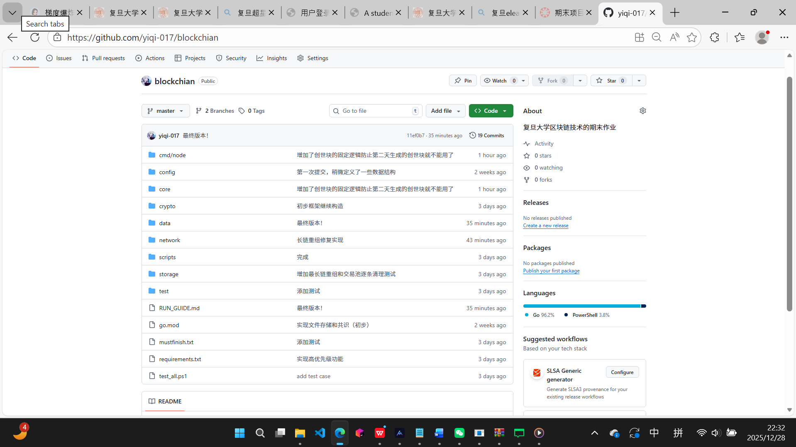
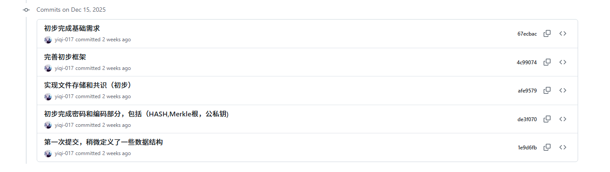
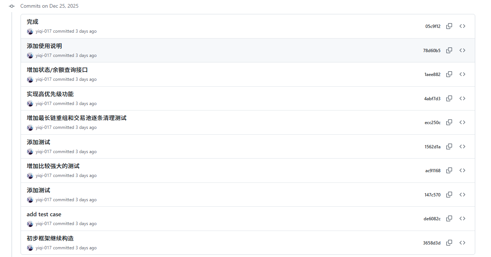
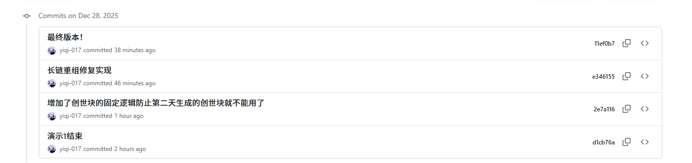

## 运行与验证指南（覆盖 mustfinish 5-11）



先克隆仓库：
```powershell
git clone https://github.com/yiqi-017/blockchian.git
cd blockchian
```

以下步骤均在仓库根目录（`blockchain/`）使用 PowerShell 运行。

### 0. 一键跑自动测试（可选）
```powershell
.\test_all.ps1
```
用于快速校验核心功能和集成用例。

### 1. 单节点基础流程（数据结构 / POW / 指令流）
```powershell
# 创世
go run ./cmd/node -mode init -node n1
# 打印钱包地址（公钥 hex，作为 miner/收款脚本）
# Windows 下可用 go run 的单文件命令：
go run ./scripts/addr.go -wallet data/n1/wallet.json
# 提交交易（自动生成/加载钱包 data/n1/wallet.json）
go run ./cmd/node -mode tx -node n1 -to alice -value 5
# 挖块（包含交易 + coinbase），miner 请填上面打印的地址
go run ./cmd/node -mode mine -node n1 -miner <你的地址> -difficulty 12
```
验证点：
- `data/n1/blocks/1.json` 出现新区块，`txpool/pool.json` 归零。
- 区块头、Merkle、POW 由程序自动校验。

### 2. 三节点网络同步（区块/交易同步、服务器进程、多端口）
打开三个 PowerShell 窗口：
```powershell
# 节点1（含 peers）
go run ./cmd/node -mode serve -node n1 -addr :8080 -peers http://127.0.0.1:8081,http://127.0.0.1:8082
# 节点2
go run ./cmd/node -mode serve -node n2 -addr :8081 -peers http://127.0.0.1:8080,http://127.0.0.1:8082
# 节点3
go run ./cmd/node -mode serve -node n3 -addr :8082 -peers http://127.0.0.1:8080,http://127.0.0.1:8081
```

在任意窗口运行：
```powershell
# 给 n1 创世
go run ./cmd/node -mode init -node n1
# 给 n2/n3 创世（可选，如果让它们同步 n1，可不执行）
go run ./cmd/node -mode init -node n2
go run ./cmd/node -mode init -node n3

# 向 n1 提交交易（PowerShell 用 Invoke-WebRequest）
$body = '{"outputs":[{"value":5,"scriptpubkey":"alice"}],"iscoinbase":true}'
Invoke-WebRequest -Uri "http://127.0.0.1:8080/tx" `
  -Method Post `
  -Headers @{ "Content-Type" = "application/json" } `
  -Body $body
# 或用 curl.exe
# curl.exe -X POST http://127.0.0.1:8080/tx -H "Content-Type: application/json" -d $body

# 在 n2 挖块
go run ./cmd/node -mode mine -node n2 -miner miner2 -difficulty 12
```
等待几秒钟，同步结果：
```powershell
curl http://127.0.0.1:8080/status
curl http://127.0.0.1:8081/status
curl http://127.0.0.1:8082/status
```
验证点：
- 三节点 `status.height` 一致。
- `txpool` 在同步后保持一致（交易广播 + 同步）。
- 服务器多端口通信正常（serve 模式）。

### 3. 余额查询接口
任何运行中的节点均可查询：
```powershell
curl "http://127.0.0.1:8080/balance?addr=alice"
```
返回 `{"address":"alice","balance":<金额>}`，用于验证链上 UTXO 余额。

### 4. 交易广播（无丢失）验证
在三节点 serve 运行时，仅向节点 A 提交交易：
```powershell
$body2 = '{"outputs":[{"value":3,"scriptpubkey":"bob"}],"iscoinbase":true}'
Invoke-WebRequest -Uri "http://127.0.0.1:8080/tx" `
  -Method Post `
  -Headers @{ "Content-Type" = "application/json" } `
  -Body $body2
# 或用 curl.exe：
# curl.exe -X POST http://127.0.0.1:8080/tx -H "Content-Type: application/json" -d $body2
```
然后在节点 B/C 查看交易池：
```powershell
curl http://127.0.0.1:8081/txpool
curl http://127.0.0.1:8082/txpool
```
验证交易已被广播并收敛到各节点池。

### 5. 长链/重组与区块校验（自动）
- 收到区块时校验 Merkle、POW、签名/余额、时间戳窗口。
- 若同高度冲突且对端链更长，自动重组为最长链。
（无需手动操作，已在网络同步与测试中覆盖）

### 6. 文件存储隔离
检查 `data/<node>/blocks` 与 `data/<node>/txpool`，不同节点目录互不污染。  
`storage_integration_test` 已自动验证，如需手查：
```powershell
dir data\n1\blocks
dir data\n2\blocks
```

### 7. 手动清理
测试数据位于 `data/` 下，可按需删除对应节点目录重新启动。

### 8. 独特设计说明与验证（示例：重组 + 交易广播防丢）
- 设计点：  
  - 长链重组：遇到同高冲突且对端链更长时，自动拉取全链校验（Merkle/POW/创世哈希）并覆盖本地。  
  - 交易广播防丢：`/tx` 接收后向 peers 推送，带 `X-No-Relay` 防环路，落块后逐条剪枝交易池。
- 手动验证重组（两节点）：  
  1) `go run ./cmd/node -mode init -node n1`；`go run ./cmd/node -mode init -node n2`。  
  2) 在 n1 挖块：`go run ./cmd/node -mode mine -node n1 -miner m1 -difficulty 12`。  
  3) 在 n2 挖不同块：`go run ./cmd/node -mode mine -node n2 -miner m2 -difficulty 12`（此时两条高度 1 的冲突链）。  
  4) 启动 n1/n2 serve 互为 peers（参考步骤 2 的 serve 命令）。  
     启动 n1：go run ./cmd/node -mode serve -node n1 -addr :8080 -peers http://127.0.0.1:8081
     启动 n2：go run ./cmd/node -mode serve -node n2 -addr :8081 -peers http://127.0.0.1:8080
  5) 在 n1 再挖一块（高度 2）：`go run ./cmd/node -mode mine -node n1 -miner m1 -difficulty 12`，等待同步。  
  6) 查询 n2 `status`：应与 n1 高度一致，区块哈希与 n1 对齐，说明 n2 已重组到更长链。  
- 手动验证广播防丢：按步骤 2 启动三节点，仅向节点 A POST `/tx`，稍等后在 B/C 的 `/txpool` 能看到同一交易，说明已推送收敛。

### 9. 自动化测试用例说明（主要自写/补充的用例）
- `cmd/node/cli_flag_test.go`：完整跑 `Run(args)` 的 `init -> mine -> tx -> mine` flag 流程，检查高度递增且挖矿后交易池被清空，覆盖 CLI 入口。
- `test/command_flow_test.go`：本地存储模拟 `init -> tx -> mine`，构造签名交易、挖块后高度 +1 且池清空，验证链式结构与池读写。
- `test/crypto_encoding_test.go`：校验 Hash256/DoubleHash256 固定输出、Merkle 根确定性与对输入敏感性、公私钥签名与验签（含篡改失败）。
- `test/data_structures_test.go`：基础数据结构健全性，包括交易 + Merkle 根、区块头高度/链式挂接、交易池增删。
- `test/pow_test.go`：小难度挖块应通过 POW 校验，篡改 nonce 后校验失败，覆盖 POW 逻辑。
- `test/storage_integration_test.go`：两个节点目录隔离（blocks/txpool 互不影响）、读回一致性、不同矿工创世哈希不同，池隔离校验。
- `network/balance_test.go`：启动 `/balance` handler，先写创世与支付交易，查询 addr1 余额应为 20，覆盖余额接口。
- `network/block_validation_test.go`：验证未来时间戳区块被拒；对端 genesis 与本地不一致时 `reorgFromPeer` 失败，覆盖区块校验与重组前置条件。
- `network/network_sync_test.go`：通过 httptest server 把节点 B 从 A 同步区块与交易池，检查区块哈希一致、池大小同步，覆盖同步 API。
- `network/reorg_test.go`：本地短链遇到对端更长链，`reorgFromPeer` 抓取并覆盖本地，校验取块次数、高度与哈希，覆盖重组逻辑。
- `network/tx_broadcast_test.go`：向节点 A POST `/tx` 会转发到 peer B，确认 B 的交易池收到，覆盖广播与防丢。
- `network/txpool_prune_test.go`：落盘包含交易的区块后按交易 ID 剪枝池，池应为空，覆盖打包后清理。
- `network/server_integration_test.go`：三个 httptest 节点互为 peers，B/C 循环同步，最终区块哈希与交易池与源节点一致，覆盖多端口服务器同步。

### GitHub 历史截图




